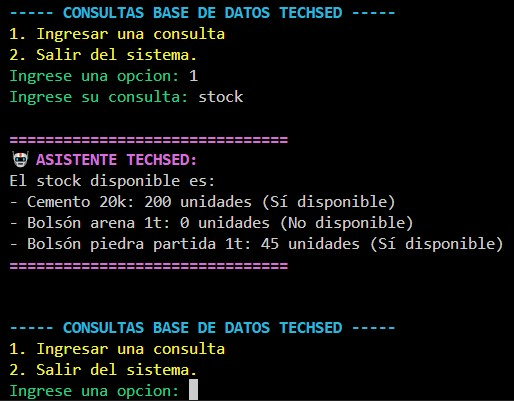
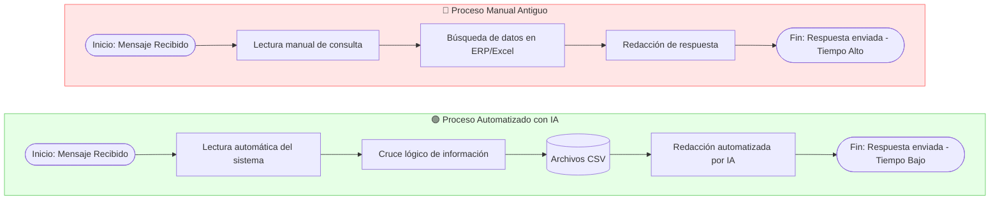

# 🚀 POC: Asistente Operativo IA - Tech-Sed

## 1. Problema
**Contexto y Flujo Actual:**
Actualmente, el equipo operativo procesa entre 50 y 100 consultas diarias de forma manual. El flujo implica leer la consulta (vía WhatsApp/Email), buscar la información fragmentada en el sistema de gestión, cruzar datos mentalmente y redactar la respuesta. Este proceso genera cuellos de botella y expone la operación a errores de tipeo o lectura (copiar/pegar).

**Supuestos asumidos para esta POC:**
* Al no contar con acceso directo al ERP o base de datos de producción, se asume que el sistema actual permite exportar el estado de situación a reportes planos (archivos `.csv`).
* Las consultas internas se realizan en lenguaje natural y pueden contener ambigüedades, por lo que se requiere un modelo de lenguaje (LLM) capaz de inferir la intención del usuario sin brindar o ser utilizada para consultas fuera del contexto puntual del sistema.

## 2. Diseño de la Solución
Se desarrolló un script interactivo en Python que actúa como intermediario entre las bases de datos de la empresa y la API de un modelo de Inteligencia Artificial de alto rendimiento.

* **Qué automatiza:** La lectura, el cruce de datos y la redacción de respuestas sobre el stock disponible, el estado de los pedidos y la información de los clientes. La IA es capaz de realizar cálculos matemáticos simples (ej. restar stock comprometido del stock total) para dar respuestas precisas.
* **Qué NO automatiza y por qué:** No automatiza la modificación de datos (ABM: Alta, Baja y Modificación de pedidos, stock o clientes). **Por qué:** En esta fase inicial (POC), otorgar permisos de escritura a un modelo generativo representa un riesgo crítico para la integridad de los datos de la empresa. La solución se diseñó bajo un principio de "solo lectura" (Read-Only) para garantizar la seguridad operativa.

## 3. Construcción y Decisiones Técnicas
* **Lenguaje y Entorno:** Se utilizó Python ejecutado en un entorno virtual (`venv`) para aislar las dependencias del proyecto.
* **Manejo de Datos:** Se empleó la librería `pandas` para simular la ingesta de datos desde 3 tablas relacionales (`clientes.csv`, `stock.csv`, `pedidos.csv`).
* **Motor de IA:** Se integró la API de **Groq** utilizando el modelo `llama-3.3-70b-versatile` (Meta). 
* **Decisión de Arquitectura:** Inicialmente se evaluó la API de Google Gemini, pero debido a restricciones de facturación regional (prepago obligatorio en tarjetas locales), se pivotó ágilmente hacia Groq. Esta decisión técnica permitió utilizar uno de los modelos recomendados  (Llama 3.3 70B) garantizando latencias ultra bajas y manteniendo el costo de la POC en $0, cumpliendo estrictamente con los requisitos del negocio. Se implementó un bloque `try-catch` para manejar posibles caídas de red y evitar la interrupción del sistema.

## 4. Limitaciones y Próximas versiones (Versión 2.0)
**Limitaciones actuales:**
* Interfaz limitada a línea de comandos (Consola/Terminal).
* Los datos son estáticos (CSV locales), requiriendo actualización manual para reflejar cambios en tiempo real.

**Propuesta para Versión 2.0:**
* **Migración de DB:** Reemplazar los CSV por una conexión directa a una base de datos relacional (ej. PostgreSQL o MySQL) mediante SQLAlchemy.
* **Despliegue Web/API:** Encapsular la lógica en un framework como Flask o FastAPI para exponer el asistente como un microservicio.
* **Omnicanalidad:** Conectar el microservicio directamente a la API de WhatsApp Web o integrarlo como un bot en Slack/Teams para el uso interno del equipo.

## 5. Ejemplo de Uso Real y Flujo de Proceso
A continuación, se muestra una captura del sistema funcionando y respondiendo en tiempo real a una consulta de stock:



### 🔄 Comparativa de Flujos: Antes vs. Ahora



## 🛠️ Instalación y Ejecución

Para testear esta POC en un entorno local, siga estos pasos:

### 1. Clonar el repositorio
Abra una terminal y ejecute:
```bash
git clone https://github.com/marianoborgini1/techsed-ejercicio.git
cd techsed-ejercicio
```

### 2. Configurar el entorno virtual (Recomendado)
Para mantener las dependencias aisladas:

```bash
# Crear el entorno
python -m venv venv

# Activar el entorno
# En Windows:
.\venv\Scripts\activate

# En Mac/Linux:
source venv/bin/activate
```

### 3. Instalar dependencias
```bash
pip install -r requirements.txt
```

### 4. Configurar variables de entorno
Cree un archivo llamado `.env` en la raíz del proyecto y pegue su API Key de GROQ: [Generar API Key](https://groq.com):

```env
GROQ_API_KEY=tu_clave_aqui
```

### 5. Ejecutar el asistente
```bash
python app.py
```

## 📂 Estructura del Proyecto

```plaintext
techsed-ejercicio/
├── data/               # Archivos CSV con la base de datos simulada
├── static/img/         # Capturas de pantalla para la documentación
├── .env                # Variables de entorno (no incluido en el repo)
├── .gitignore          # Archivos excluidos de Git
├── app.py              # Script principal con la lógica e interfaz ANSI
├── README.md           # Documentación técnica y funcional
└── requirements.txt    # Librerías necesarias (Pandas, Requests, Dotenv)
```
